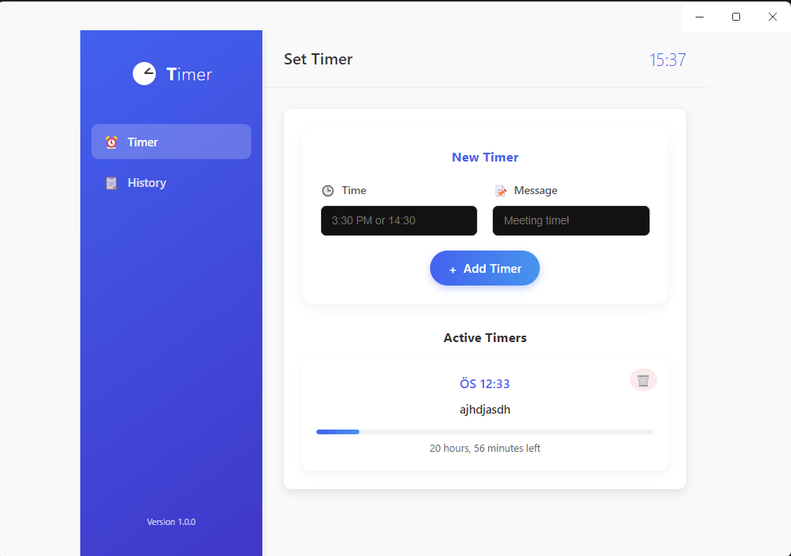

# Timer Application

A simple desktop timer application built with Electron and Vue.js to help you manage your time efficiently.



## Features

- Create timers with custom messages
- Set timers using 12-hour (AM/PM) or 24-hour format
- Get notifications when timers are complete
- View complete alarm history
- Minimize to system tray for background operation
- Modern and intuitive user interface

## Installation

### Windows
Download the latest `Timer Setup x.x.x.exe` from the [Releases](https://github.com/savhascelik/timer/releases) page and run the installer.

### Mac and Linux
Coming soon!

## Development

### Prerequisites
- Node.js (v14 or newer)
- npm or yarn

### Setup
```bash
# Clone the repository
git clone https://github.com/savhascelik/timer.git

# Navigate to the project directory
cd timer

# Install dependencies
npm install

# Start the development server
npm run dev
```

### Build
```bash
# Build for Windows
npm run build:win

# Build for macOS
npm run build:mac

# Build for Linux
npm run build:linux
```

## Technologies Used

- Electron - Cross-platform desktop app framework
- Vue.js - Frontend framework
- TypeScript - Type-safe JavaScript
- Vite - Build tool
- Electron Builder - Application packaging

## Acknowledgments

This project was initially based on [electron-vue-template](https://github.com/Deluze/electron-vue-template) by [Deluze](https://github.com/Deluze), which provided a solid foundation for the application's structure. The original template is available under the MIT license.

## License

This project is licensed under the MIT License - see the LICENSE file for details.

## Author

Savas Hasçelik - [GitHub](https://github.com/savhascelik)
